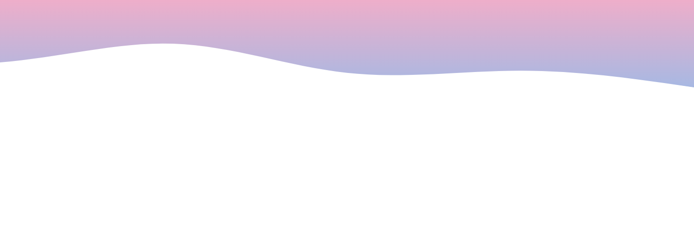
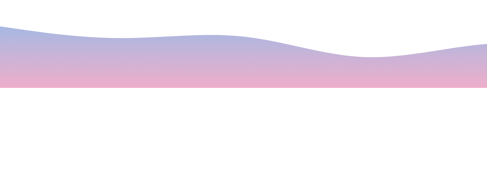

<h2 align="left">Hi there! 👋

I'm Minn Thike Tunn, a passionate university student from Myanmar 🇲🇲.

💡 I love thinking. 
🔥 I love challenges

Currently diving into web development, algorithms, and open-source contributions. Always excited to collaborate and build cool stuff!

Let's connect and create something amazing together! 🚀</h2>
  

###

  
  
  

## 🏆 GitHub Trophies

### ✍️ Random Dev Quote

###

###

  
  
  
  
  
  
  
  
  
  
  
  
  
  
  
  
  
  
  
  
  
  
  
  
  

###

  
  

###

<picture>
  <source media="(prefers-color-scheme: dark)" srcset="https://raw.githubusercontent.com/MinnThikeTunn/MinnThikeTunn/output/pacman-contribution-graph-dark.svg">
  <source media="(prefers-color-scheme: light)" srcset="https://raw.githubusercontent.com/MinnThikeTunn/MinnThikeTunn/output/pacman-contribution-graph.svg">
  
</picture>

###

